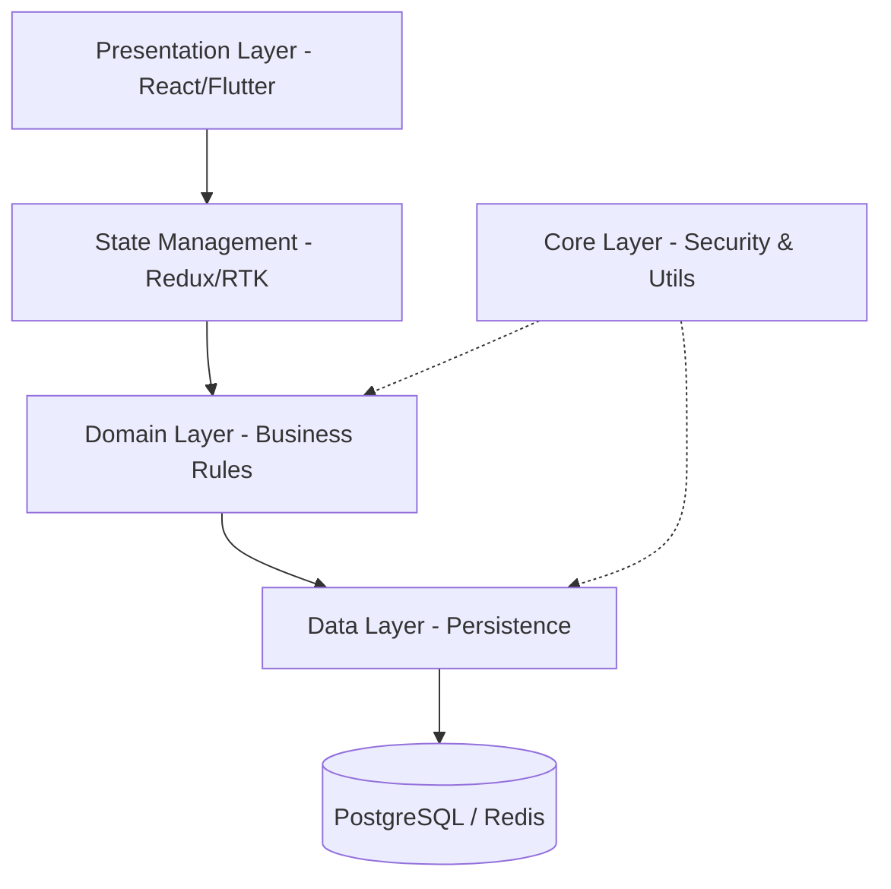

# SHAMMAH CAPITAL INVESTMENT 🚀
### Secure Capital Investment, Savings & Loan Platform

SHAMMAH CAPITAL INVESTMENT is an enterprise-grade financial ecosystem designed to provide secure savings, loans, and investment services. Built on the principles of **Clean Architecture** and **Zero Trust Security**, the platform ensures financial integrity and rapid emergency relief through AI-driven risk scoring.

---

## 🏛️ Architecture at a Glance

The system follows a **Layered Clean Architecture** combined with a **Microservices** approach to ensure scalability and maintainability.

## 🔐 Core Value Pillars

| Pillar | Description |
| :--- | :--- |
| **Trust Scoring** | Real-time identity & financial behavior evaluation. |
| **Loan Agility** | Fast-track emergency processing via automated risk engines. |
| **Data Integrity** | AES-256 encryption and field-level PII protection. |
| **Seamless UX** | Dashboard-driven interfaces for clarity and financial insight. |

## 📂 Project Structure

- `docs/`: Detailed technical specifications and diagrams.
- `src/`: (Future) Source code following DDD principles.
- `scripts/`: Operational and automation scripts.

## 🚀 Getting Started

To explore the technical depth of this platform, please refer to the following documents:

1.  **[Full Technical Specification](./docs/technical_specification.md)** - Deep dive into architecture, security, and entities.
2.  **[Implementation Plan](./implementation_plan.md)** - Current development roadmap.

---

> [!IMPORTANT]
> This system enforces **MFA (Multi-Factor Authentication)** and **KYC (Know Your Customer)** compliance as mandatory requirements for all financial transactions.

---
© 2026 Shammah Capital Investment Group. All Rights Reserved.
