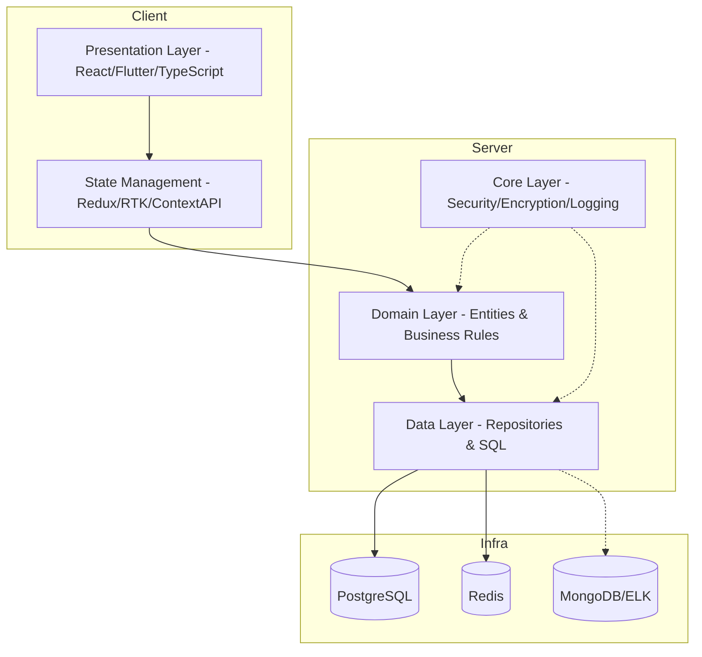
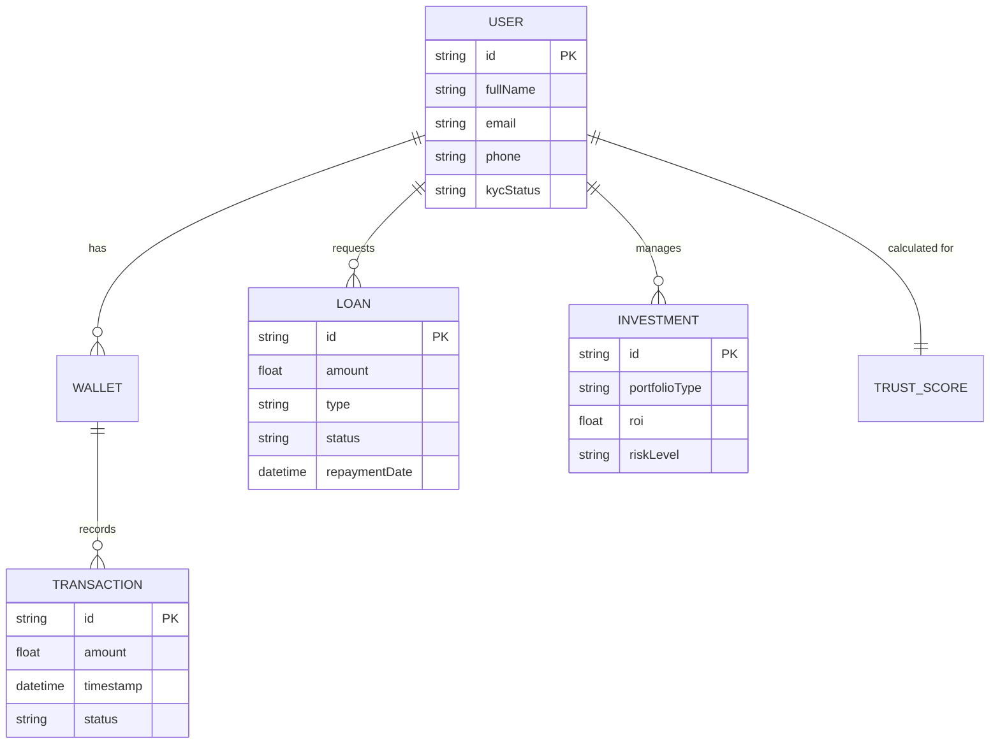

# System Documentation: SHAMMAH CAPITAL INVESTMENT
## Full Technical Specification (v1.0.0)

---

## 1. Document Overview
This document defines the complete architecture, design, security model, and implementation structure of **SHAMMAH CAPITAL INVESTMENT**. The platform is built as a secure financial ecosystem for:
- Savings management
- Loan services (standard & emergency)
- Investment portfolios
- Digital wallet operations
- Identity & trust scoring

> [!NOTE]
> The system follows **Clean Architecture + Domain-Driven Design (DDD) + Security-by-Design + Zero Trust Principles**.

---

## 2. System Architecture
### 2.1 Architecture Style
- **Microservices architecture**
- **Event-driven communication**
- **Layered Clean Architecture**

### 2.2 Visual Layer Model

---

## 3. Core Layer (Foundation)
### 3.1 Responsibilities
The Core Layer provides non-functional cross-cutting concerns primarily focused on security and infrastructure.

| Component | Responsibility |
| :--- | :--- |
| **Security Manager** | Handles JWT issuance, validation, and session lifecycle. |
| **Crypto Service** | AES-256 GCM encryption engine and password hashing (Argon2). |
| **Config Manager** | Secure environment and vault secret management. |
| **Logger Service** | Centralized audit trails and error tracking. |
| **Rate Limiter** | Prevents brute-force and DDoS at the app level. |

---

## 4. Domain Layer (Business Logic)
### 4.1 Core Entities

### 4.2 Business Rules
1.  **Loan Eligibility**: Dependent on the dynamic `TrustScore`.
2.  **Withdrawals**: Require verified MFA session and balance validation.
3.  **Investments**: Restricted to users with `KYC_COMPLETE` status.
4.  **Emergency Loans**: Evaluated using real-time AI risk assessment.

---

## 5. Security Model (Zero Trust)
### 5.1 Security Hierarchy
The platform implements a tiered security approach:

#### Level 1: Basic
- HTTPS (TLS 1.3)
- Bcrypt/Argon2 hashing
- Secure Input Validation

#### Level 2: Intermediate
- **MFA**: OTP, Authenticator apps, and E-mail verification.
- **RBAC**: Role-Based Access Control for all API endpoints.
- **CSRF & XSS Protection**.

#### Level 3: Advanced
- **JWT Rotation**: Short-lived access tokens with secure refresh tokens.
- **Device Fingerprinting**: Anomalous login detection.
- **Field-Level Encryption**: Encrypting PII (Personally Identifiable Information) in the DB.

---

## 6. Technology Stack
| Layer | Technologies |
| :--- | :--- |
| **Frontend** | React, TypeScript, Flutter, Redux Toolkit |
| **Backend** | Java (Spring Boot), Node.js (NestJS), Go (High performance microservices) |
| **Persistence** | PostgreSQL, Redis (Caching), MongoDB (Analytics) |
| **Infrastructure** | Docker, Kubernetes, AWS/Azure/GCP |
| **Security** | HashiCorp Vault, Cloudflare (WAF/DDoS), SIEM monitoring |

---

## 7. Testing & Quality Assurance
- **Unit Testing**: Focus on Domain logic and Security functions.
- **Security Testing**: Daily automated Penetration tests (SQLi, XSS, Auth Bypass).
- **Performance**: Target <200ms API response time under 10k+ concurrent users.
- **Fraud Simulation**: Stress-testing the system with rapid transaction atacks.

---

### 9.2 Dashboard Mockup

## 10. Final Summary
**SHAMMAH CAPITAL INVESTMENT** is a secure, scalable, and trust-driven financial ecosystem. It prioritizes identity verification and real-time fraud detection without sacrificing high usability for its stakeholders.
